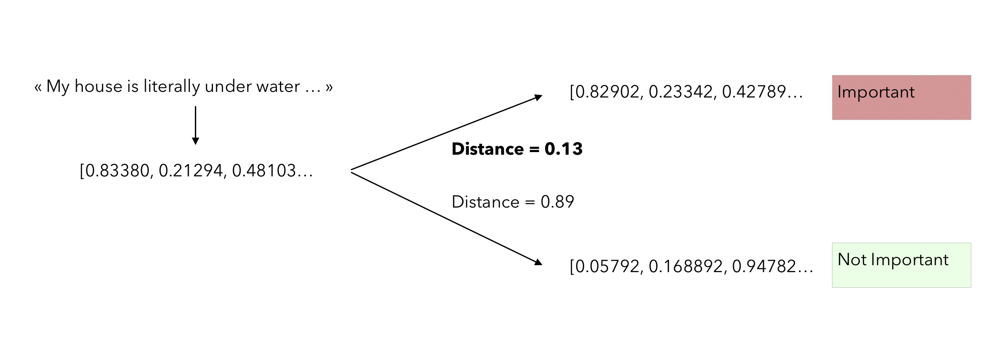
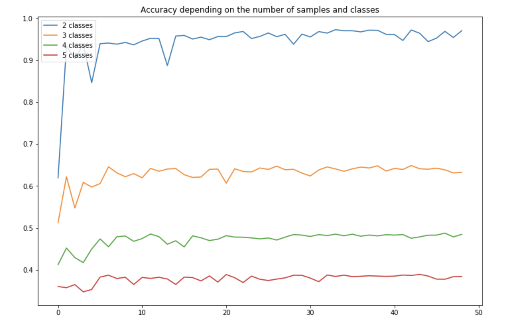
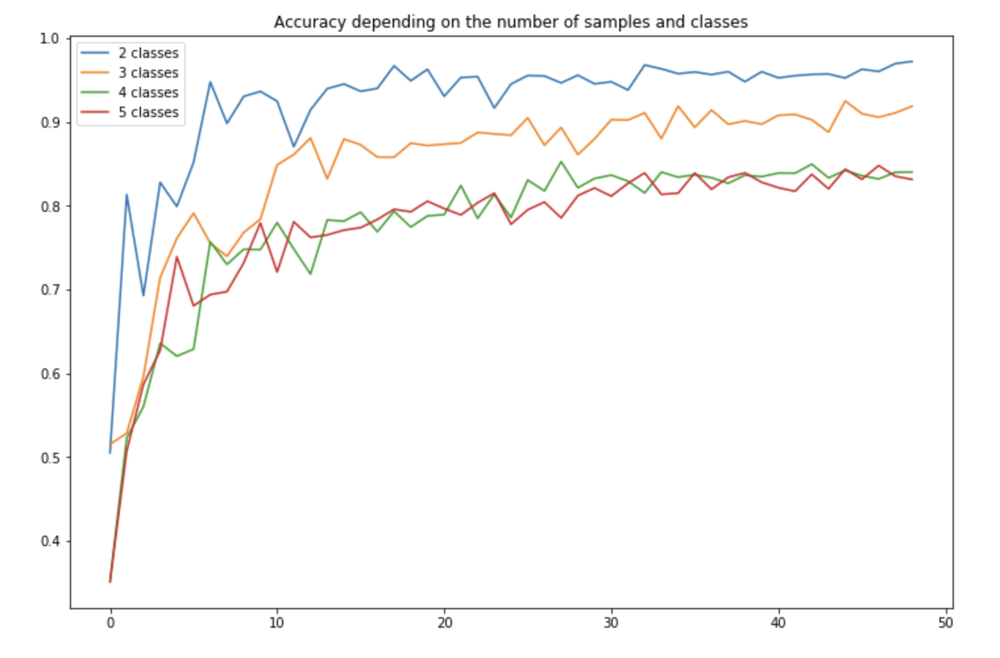

# Few Shot Text Classification

 

*Use Case* : A user has a column of short texts (e.g user reviews) but those comments are not labeled. We ask the user to hand-label just a few texts for each class (i.e. few-shot), and provide a method that leverages pre-trained embeddings to generalize the classification.

This library will gather several state-of-the-art techniques. We will present the concepts behind each algorithm and its implementation in the section below.

## Table of Contents <!-- omit in toc -->

- [Installation](#Installation)
  - [With pip](#With-pip)
  - [From source](#From-source)
- [Implemented Models](#Models)
- [Getting started](#Getting-started)
  - [Preparing your data](#Preparing-your-data)
    - [Manual](#Manual)
    - [With converters](#With-converters)
  - [Downloading pre-trained models](#Downloading-pre-trained-models)
  - [Training models](#Training-models)
  - [Making predictions](#Making-predictions)
  - [Evaluating models](#Evaluating-models)
- [Notebook Examples](#Notebook-Examples)
- [Contributing](#Contributing)
- [References](#References)
- [LICENSE](#LICENSE)

## Installation

### With pip

(To come)

```shell
pip install fstc
```

### From source

```shell
git clone https://github.com/fstc-suite/ftsc.git
cd cdQA
pip install -e .
```

## Implemented Models

### Pre-trained WordEmbedding and Cosine Similarity

Implementation of [Few-Shot Text Classification with Pre-Trained Word Embeddings and a Human in the Loop](https://arxiv.org/pdf/1804.02063.pdf) by Katherine Bailey and Sunny Chopra Acquia.

This simple approach relies on :
- computing the mean embedding of each class using a pre-trained word embedding (Word2Vec)
- for a new example, find the closest class using the cosine distance

We can illustrate it the following way :



The model performance on the test dataset we provide (`Datasets` folder) is the following:



### Pre-trained WordEmbedding and Classifier

Extension of [Few-Shot Text Classification with Pre-Trained Word Embeddings and a Human in the Loop](https://arxiv.org/pdf/1804.02063.pdf) by Katherine Bailey and Sunny Chopra Acquia.

This approach relies on :
- apply data augmentation (replace, delete, insert, swap words)
- computing the different embeddings for each class using a pre-trained word embedding (Word2Vec)
- fit a classifier (K-NN, Random Forest) on the training samples
- for a new example, use the trained classifier

The model performance on the test dataset we provide (`Datasets` folder) is the following:



## Getting started

### Preparing your data

We offer a text pre-processing pipeline as well as data augmentation techniques.

#### Manual

To use `fstc` you need to create a Pandas DataFrame with the following columns:

| Text              | Label               |
| ----------------- | --------------------|
| First short text  | Label of first text |
